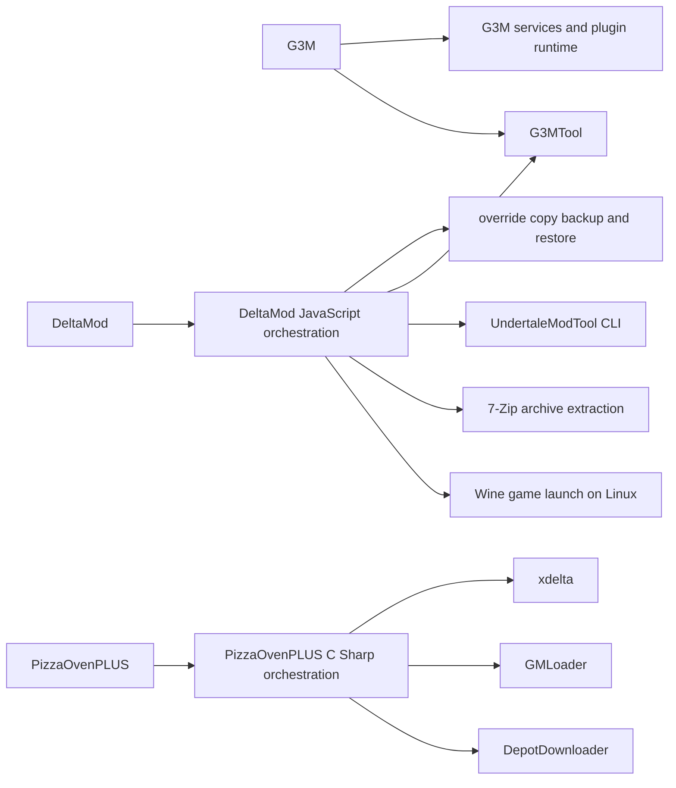
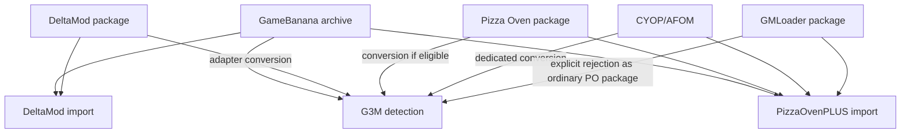
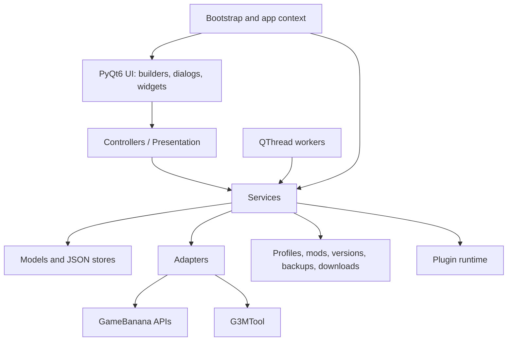
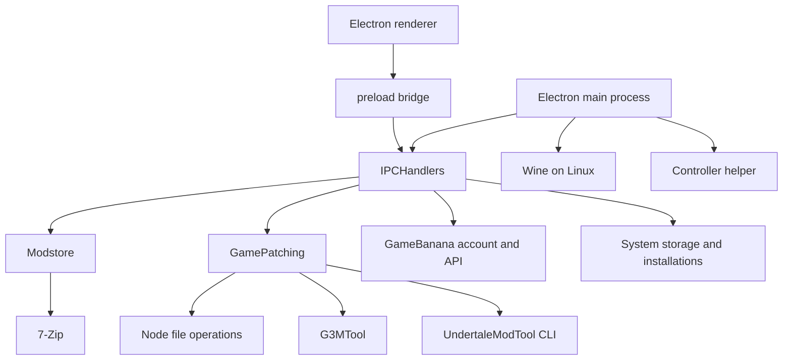
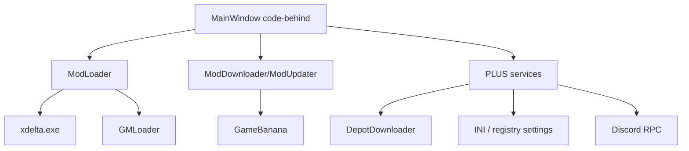
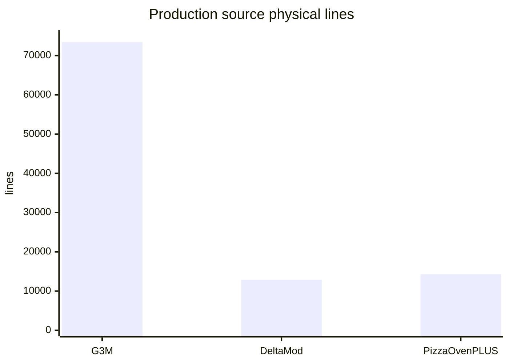
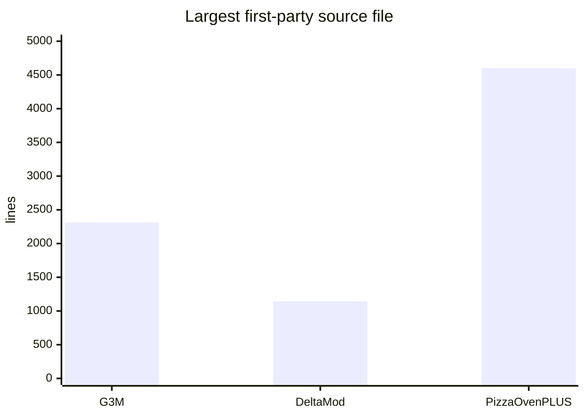

# G3M, DeltaMod, and PizzaOvenPLUS: evidence-based technical comparison

> Data snapshot: **August 6, 2026, Europe/Oslo**.  
> Examined revisions: G3M `4cea778e9129ee3867112e25ad1021bcf0480d26`; DeltaMod `df08a6ea9040593aeccde1bf60ccd02eac79427e`; PizzaOvenPLUS `2cafef50c52ac1353fd748e8f15d05924c8839de`.

## Contents

1. [Method and evidence rules](#1-method-and-evidence-rules)
2. [Findings](#2-findings)
3. [Ownership and implementation provenance](#3-ownership-and-implementation-provenance)
4. [Summary table](#4-summary-table)
5. [Feature matrix](#5-feature-matrix)
6. [Games and platforms](#6-games-and-platforms)
7. [Mod formats and patching pipelines](#7-mod-formats-and-patching-pipelines)
8. [Architecture](#8-architecture)
9. [G3M implementation](#9-g3m-implementation)
10. [DeltaMod implementation](#10-deltamod-implementation)
11. [PizzaOvenPLUS implementation](#11-pizzaovenplus-implementation)
12. [Repository statistics](#12-repository-statistics)
13. [Public distribution metrics](#13-public-distribution-metrics)
14. [Releases and distribution sizes](#14-releases-and-distribution-sizes)
15. [Documentation](#15-documentation)
16. [Tests, CI, and build reproduction](#16-tests-ci-and-build-reproduction)
17. [Security and trust boundaries](#17-security-and-trust-boundaries)
18. [Profiling and benchmarks](#18-profiling-and-benchmarks)
19. [Maintenance indicators](#19-maintenance-indicators)
20. [Selection by requirement](#20-selection-by-requirement)
21. [Features found in one examined project](#21-features-found-in-one-examined-project)
22. [Study limits](#22-study-limits)
23. [Evidence and sources](#23-evidence-and-sources)

## 1. Method and evidence rules

Feature tables use five short statuses:

- **Yes**: source code, a successful build, or a direct measurement confirms the capability.
- **Partial**: the project implements a narrower variant or uses a different model.
- **No**: targeted source and documentation searches found no implementation in the examined revision.
- **Unknown**: the available evidence cannot confirm or reject the capability.
- **N/A**: the capability falls outside the product's scope.

Text after a status names the implementation or the evidence limit. `No` describes the examined revision and public documentation; it does not cover private code or later releases. Counts from GitHub, GameBanana, and itch.io remain separate because each service counts a different event. The report does not convert downloads into users or combine counters across services.

**PizzaOvenPLUS** refers to SurfyCrescent97's repository and the PO+ GameBanana submission with ID `21866`. Tekka's original **Pizza Oven**, GameBanana ID `12625`, appears as historical context. Cristiandis's **Pizza Oven Plus Cross-Platform**, GameBanana ID `22718`, represents a separate codebase and publication.

## 2. Findings

- **G3M covers seven built-in game targets plus custom games.** The examined source also contains profiles, mod and game snapshots, a persistent download queue, plugins, a mod editor, manual mapping, diagnostics, modpack creation, and patch tools. Its repository supplied 1,476 collected tests and CI jobs for Windows, Linux, macOS x64, and macOS arm64.
- **DeltaMod implements six game descriptors. No other examined source contains its set of GameBanana account operations.** Its source contains login, likes, comments, Collection creation, and Collection-based mod-list backup. Its patch pipeline combines native file operations, a binary-patch processor, and UndertaleModTool CLI for CSX scripts.
- **PizzaOvenPLUS targets Pizza Tower.** Its source contains AFOM/CYOP handling, mod folders, Steam depot downgrade controls, GMLoader integration, themes, music controls, a tutorial, Discord Rich Presence, and update settings. The public project targets `net7.0-windows`, contains no test project or CI workflow, and places 4,601 lines in `MainWindow.xaml.cs`.
- **The projects solve different scopes.** G3M supplies seven built-in targets, custom-game definitions, and an extension API. DeltaMod supplies account and Collection operations. PizzaOvenPLUS supplies Pizza Tower downgrade and GMLoader workflows.

## 3. Ownership and implementation provenance

### 3.1 Ownership

| Project | Primary Author/Owner | License | First commit in the examined history |
| --- | --- | --- | --- |
| G3M, previous name DELTAHUB | **Y114**; the `Y114` and `y114git` names belong to the same author | GPL-3.0 | 2025-08-13 |
| DeltaMod | DELTAModders; the GhinoRhino identity authored 336 of 380 commits | EUPL-1.2 | 2025-09-11 |
| PizzaOvenPLUS | SurfyCrescent97; the project extends Tekka's Pizza Oven | GPL-3.0 | 2026-01-31 |

Y114 authored **G3M** and **G3MTool**. DeltaMod's source and documentation identify that utility as an external dependency for `.xdelta` and `.g3mpatch` operations. DELTAModders authored DeltaMod's interface, package standard, installation model, GameBanana integration, patch orchestration, and controller workflow.

### 3.2 Dependency map

### 3.3 Attribution boundaries

- The ownership table assigns credit at project level; the dependency map assigns credit at component level.
- DELTAModders receives authorship credit for DeltaMod and its product-level implementation. DeltaMod delegates specific patch formats to external processors.
- SurfyCrescent97 receives authorship credit for PizzaOvenPLUS. The report identifies inherited Pizza Oven behavior where the source or documentation provides that provenance.

## 4. Summary table

| Criterion | G3M 3.3.1 revision | DeltaMod 2.0.4 revision | PizzaOvenPLUS 1.0.9 revision |
| --- | --- | --- | --- |
| Primary stack | Python 3.14+, PyQt6 | Node.js, Electron 40 | C#, WPF, .NET 7 Windows |
| Product scope | Multi-game GameMaker mod manager | Manager for DELTARUNE and compatible GameMaker games | Pizza Tower and its ecosystem |
| Built-in game targets | 7 + custom games | 6 descriptors | Pizza Tower |
| Windows | Yes | Yes | Yes |
| Linux | Yes: native packaged build | Yes: native manager build; games run through Wine | Unknown: this WPF repository provides no Linux implementation; a separate cross-platform project exists |
| macOS | Yes: x64 and arm64 build matrix | No: no published build; project documentation lists macOS as planned | No: the project targets `net7.0-windows` |
| GameBanana browser | Yes | Yes | Yes: Pizza Tower |
| GameBanana 1-click | Yes: `g3m://`, legacy `deltahub://` | Yes: `deltamod://` | Yes: Pizza Oven protocol/pair flow |
| GameBanana login | No | Yes | Partial: pairing flow; no like, comment, or Collection handlers found |
| Like and comment from the application | No | Yes | No: no implementation found in the examined source or first-party documentation |
| GameBanana Collections | No | Yes: create/delete/backup/restore | No: no implementation found in the examined source or first-party documentation |
| Several active mods | Yes | Yes: native orchestration with binary-patch merge | Yes: GMLoader merge; xdelta target conflicts remain |
| Profiles | Yes: import/export/duplicate/order | Partial: multiple installation systems use a different model | Partial: mod folders; no profile import, export, or duplication found |
| Versions of individual mods | Yes | Partial: manifest version and update handlers; no local snapshot system found | Partial: GameBanana updater; no local snapshot system found |
| Game versions/restore points | Yes | Yes: installation copy and `.bak` restore | Yes: `data.win.po`, restore, and downgrade |
| Plugins | Yes: API 1.1.0, directory, hooks, relations | No: no manager plugin API found | No: no manager plugin API found; GMLoader belongs to game mods |
| Mod Editor | Yes | Partial: external MiscTools creates manifest/XML files | Partial: metadata and UI edit paths; no multi-game package editor found |
| Modding Tools | Yes: create/apply/merge/info/diff/convert | Yes: native override/copy/restore, external binary and CSX processors, external MiscTools | Yes: xdelta create/apply, GMLoader convert, downgrade |
| Themes | Yes: bundled themes, import/export, colors, media, and fonts | Yes: 14 built-in JSON themes plus custom import | Yes: presets, save/load, colors, background, and transparency |
| Localization | Yes: 7 bundled languages plus external/plugin strings | Partial: English UI in the examined files | Yes: INI language system and language update support |
| Discord Rich Presence | Yes: switchable | Unknown: Discord community links exist; no user RPC implementation confirmed | Yes: switchable |
| Automated tests | Yes: 1,476 passed tests in the measured snapshot | No: no test suite found; `npm test` runs Electron | No: no test suite found |
| CI | Yes: test and build/release matrices | No: no GitHub Actions workflow found | No: no GitHub Actions workflow found |
| Public documentation | Yes: 70 G3M pages plus 11 G3MTool pages | Yes: README, website, itch.io, and MiscTools | Yes: README, Google Sheet, and GameBanana |

## 5. Feature matrix

Status terms follow Section 1. Table cells add a short scope note where implementations differ.

### 5.1 Search, download and import

| Capability | G3M | DeltaMod | PizzaOvenPLUS |
| --- | --- | --- | --- |
| Built-in GameBanana browser | Yes: for all games with GameBanana ID | Yes: Mod Shop | Yes: Pizza Tower browser |
| Text search | Yes | Yes | Yes |
| Categories/types | Yes | Yes | Yes |
| Sorting and pagination | Yes | Yes | Yes |
| NSFW filter | Yes | No: no separate user switch found | Yes |
| View description | Yes: rich HTML/markdown handling | Yes: sanitization renderer-side | Yes: HTML/FlowDocument conversion |
| Screenshots and media gallery | Yes | Yes | Yes |
| Several files per publication | Yes: select a specific file | Yes: download flow supports file selection | Yes: select one file or download all |
| GameBanana 1-click | Yes | Yes | Yes: Inherited from Pizza Oven |
| External URL | Yes | Yes | Yes: via protocol parsing |
| Local archive | Yes: ZIP, 7z, RAR, tar.gz, LZMA, and GZip | Yes: 7-Zip extraction path | Yes: ZIP/7z/RAR through SevenZipExtractor and SharpCompress |
| Local folder | Yes: drag-and-drop/import | Yes: folder import after extraction | Yes: drag-and-drop folders and archives |
| Permanent download queue | Yes: JSON history and separate download/use states | No: targeted search found no persistent queue model | Partial: progress windows; no shared persistent queue found |
| Cancel/retry | Yes | Partial: progress and callback paths; no shared queue model | Yes: cancellation tokens and progress windows |
| Auto-use after loading | Yes: customizable | Yes: import after download | Yes: extract/install flow |
| Delete archive after use | Yes: setting | Partial: one import branch retains the archive for debugging | Yes: code branches remove downloaded temporary files |
| Save local imports to history | Yes | No | No |
| Blocklist | Yes: global or per-game by ID, name, or category | No | No |
| GameBanana account login | No | Yes: Electron login window plus `safeStorage` | Partial: pairing flow in `ModDownloader` |
| Like from the application | No | Yes | No |
| Comment from the application | No | Yes | No |
| Collections backup/restore | No | Yes | No |

### 5.2 Library and organization

| Capability | G3M | DeltaMod | PizzaOvenPLUS |
| --- | --- | --- | --- |
| Local library | Yes | Yes | Yes |
| Turning mods on/off | Yes | Yes | Yes: selection and launch through the folder system |
| Mod order | Yes: priority workflow | Yes: enabled list and merge order | Partial: GMLoader merge/conflict flow |
| Multiple profiles | Yes: full profiles | Partial: multiple installations use a different model | Partial: mod folders use a narrower model |
| Create/rename/duplicate profile | Yes | Partial: create, name, and delete installations; no duplicate action found | Partial: create, select, and delete mod folders |
| Rearrange profiles | Yes | Partial: reorder installations | No: no profile ordering found |
| Import/export profile | Yes | Partial: installation shortcuts and Collection backup use different data models | No |
| Profile settings | Yes | Partial: settings use system and installation flags | Partial: INI settings and a selected mod folder; no profile entity found |
| DELTARUNE chapter state | Yes: per-chapter selections | No: the game descriptor and manifest have no user-facing chapter-state model | N/A |
| Snapshot Mod Versions | Yes: create/import/switch/delete/download | No: no local snapshot system found | No: no local snapshot system found |
| Snapshot versions of the game | Yes: create/apply/export/import/delete | Partial: separate installation copy and restore | Partial: backup and downgrade; no arbitrary snapshot catalog found |
| README inside the mod | Yes: Markdown/text/HTML/PDF detection and viewer | Partial: description and metadata | Partial: metadata and description viewer |
| Open mod folder | Yes | Yes | Yes |
| Export mod | Yes | Partial: Collection backup stores mod-list metadata without mod payload archives | Yes: save a Pizza Tower folder as a mod; the UI warns about full-game export |
| Delete mod | Yes | Yes | Yes |
| Update mod | Yes: GameBanana-linked versions | Yes: GameBanana metadata | Yes: `ModUpdater`; a setting disables it |
| Diagnose conflicts before launch | Yes: separate read-only diagnostics report | Yes: hash, manifest, and patch conflict checks | Partial: GMLoader conflict dialog and runtime logs |

### 5.3 Creation and conversion

| Capability | G3M | DeltaMod | PizzaOvenPLUS |
| --- | --- | --- | --- |
| Create a new mod in GUI | Yes | Partial: MiscTools creates manifest/XML files; DeltaMod has no full package editor | Yes: Pizza Tower tutorial, metadata edit, and save paths |
| Edit metadata | Yes | Partial: external MiscTools | Yes |
| Icon and screenshots | Yes | Partial: metadata and theme assets | Yes: existing structure and UI |
| Game-aware file layout | Yes | Yes: `game` in manifest plus `modding.xml` targets | Yes: Pizza Tower layout |
| Manual mapping target paths | Yes | Yes: `modding.xml` declares target paths | Yes: Pizza Tower target paths |
| Import DeltaMod package | Yes: dedicated adapter | Yes: native format | No |
| Import Pizza Oven package | Yes: dedicated conversion service | No: no dedicated converter found | Yes: native format |
| CYOP/AFOM | Yes: dedicated conversion/tag | No: dedicated flow | Yes: one of the main features of PO+ |
| GMLoader packages | No: the regular Pizza Oven converter rejects this package type | No | Yes: build, merge, convert, and process-stop helpers |
| Creating a modpack | Yes | Partial: external MiscTools plus package format | Partial: GMLoader merge; no general portable modpack format found |
| TOML metadata | Yes: DeltaMod import follows the format | Yes: main `meta.toml`; legacy JSON converted | No |
| JSON metadata | Yes: `mod_config.json` plus conversion paths | Yes: legacy `meta.json` converts to TOML | Yes: metadata structures and API cache |
| XML instruction file | Yes: imports DeltaMod `modding.xml` | Yes: requires `modding.xml` | No: no shared XML instruction format found |

### 5.4 Patching and launch

| Capability | G3M | DeltaMod | PizzaOvenPLUS |
| --- | --- | --- | --- |
| `.xdelta` / `.vcdiff` apply | Yes | Yes: external binary-patch processor; see Section 7.2 | Yes: via bundled xdelta |
| `.g3mpatch` | Yes | Yes: external binary-patch processor; see Section 7.2 | No |
| `.csx` | Yes | Yes: UndertaleModTool CLI path | Partial: GMLoader supplies a separate script pipeline |
| Raw DATA replacement | Yes | Yes: `override` and `copy` instructions | Yes: Pizza Tower data, executable, and assets |
| Extra-file overrides | Yes: target planning and restore manifest | Yes: declarative override/copy | Yes: Pizza Tower-specific copy/move rules |
| Merge patches | Yes | Yes: grouped binary-patch stage; see Section 7.2 | Partial: GMLoader merge; regular duplicate targets conflict |
| Create patch | Yes | Partial: patching view and MiscTools; the application source contains an apply pipeline | Yes: xdelta create helper |
| Patch info | Yes | Partial: manifest and UI metadata | Partial |
| Diff report | Yes | No: no built-in diff report found | No: no diff report found |
| Backup before change | Yes: manifest and transaction restore | Yes: game copy and `.bak` | Yes: `data.win.po`, directory restore |
| Recovery after exit | Yes: launch transaction | Yes: restore | Yes |
| Direct launch chapter | Yes: for supported DELTARUNE tabs | No: no chapter selector found | N/A |
| Steam launch | Yes | Yes | Yes |
| Linux Wine | Yes: resolver and custom path | Yes: required for Windows game executables | N/A: Windows-only WPF project |
| PortProton | Yes | No | No |
| Desktop shortcut | Yes: captured state and headless `--shortcut` | Yes: per-installation link | Partial: startup registration and launcher shortcuts; no captured mod state found |
| Controller mode | Partial: regular Qt navigation; no dedicated DualSense mode | Yes: DualSense-oriented controller mode | No: no dedicated controller mode found |
| Debug launch | Partial: custom executable and diagnostics; no Pizza-specific debug toggle | Partial: developer mode and DevTools | Yes: launch with debug toggle |

### 5.5 Interface, extension and maintenance

| Capability | G3M | DeltaMod | PizzaOvenPLUS |
| --- | --- | --- | --- |
| Custom title bar | Yes | Yes: frameless Electron | Unknown: WPF UI does not establish a custom title-bar feature |
| UI scale | Yes | Yes: Electron/browser scaling | Partial: WPF resize logic without a centralized scale setting |
| Fullscreen | Yes | Yes | No: no fullscreen mode found |
| Themes | Yes: 4 bundled archives plus import/export | Yes: 14 JSON themes plus custom import/rename/delete | Yes: presets, save/load, background, and colors |
| Custom fonts | Yes | Partial: theme assets | Partial: bundled Roboto; no general font importer found |
| Custom logo | Yes | Partial: theme assets | Yes: custom asset system |
| Background image/media | Yes | Yes: theme backgrounds and audio | Yes |
| Startup sound/music | Yes | Yes: menu music, SFX, and dynamic music | Yes: custom music, volume, mute, and focus mute |
| Localization | Yes: 7 bundled languages plus external and plugin strings | No: no multilingual catalog found | Yes: INI language system and DEF/PNG update support |
| Announcements | Yes | Partial: sponsor, community, and update messages | Yes: JSON announcements |
| Changelog/patch notes | Yes | Yes: changelog and update UI | Yes: patch-notes section |
| Auto-update | Yes: check and download UI | Partial: Windows update flow; Linux README states no native updater | Yes: Onova-based updater and 1.0.3 fix |
| Plugin API | Yes | No | No |
| Plugin lifecycle hooks | Yes: 20 hooks | No | No |
| Required/conflicting plugins | Yes | No | No |
| Plugin settings/main views | Yes | No | No |
| Bundled catalog plugins | Yes: DR Save Manager and Custom Saves Folders | No | No |
| Discord Rich Presence | Yes | Unknown | Yes |
| Support package | Yes: collects redacted diagnostics | Partial: diagnostic information and error UI | Partial: runtime logs; no redacted bundle builder found |
| Log viewer | Yes | Yes: console and Electron tracer | Yes: logger panel and files |
| Single instance | Yes | Yes: Electron application lifecycle | Unknown: no documented single-instance contract found |
| Data-root relocation | Yes | Yes: Electron `userData` systems | Yes: assembly-relative, registry, and INI storage |

## 6. Games and platforms

### 6.1 Supported games

| Game/goal | G3M | DeltaMod | PizzaOvenPLUS |
| --- | --- | --- | --- |
| DELTARUNE paid | Yes: chapters 0-5 | Yes | No: no manager target |
| DELTARUNE Demo Steam | Yes | Yes | No |
| DELTARUNE Demo LTS/itch | Partial: one demo target with full-install | Yes: separate LTS descriptor | No |
| UNDERTALE | Yes | Yes | No |
| UNDERTALE Yellow | Yes: full-install | Yes: GameJolt autodownload metadata | No |
| Pizza Tower | Yes | Yes | Yes: manager target |
| Sugar Spire | Yes: full-install | No | No |
| FRICKBEARS3 | Yes: full-install and add-on conversion | No | No |
| Custom GameMaker Games | Yes: executable, DATA filename, Steam ID, and GameBanana ID | Partial: descriptor files exist; no custom-game editor found | No |

G3M source defines six DELTARUNE tabs: main menu and chapters 1-5. DeltaMod stores game targets in JSON and defines `exeName`, GameBanana ID and optional feature `steam` or `autodownload`. PizzaOvenPLUS uses `PizzaTower.exe` and `data.win` across its path model, backup, downgrade, and interface code. The examined revision defines no other manager target.

### 6.2 Application Platforms

| Platform | G3M | DeltaMod | PizzaOvenPLUS repo |
| --- | --- | --- | --- |
| Windows x64 | Yes: build and installer | Yes: installer | Yes: WPF build |
| Linux x64 | Yes: native PyInstaller build | Yes: AppImage and files; games run through Wine | No: the source project targets `net7.0-windows` |
| macOS x64 | Yes | No: no published build found | No |
| macOS arm64 | Yes | No: no published build found | No |
| Windows emulation | N/A: native builds exist | Yes: README marks it usable | Unknown: project documentation makes no support claim |

The PizzaOvenPLUS Google Sheet README includes the line “Linux Support, handled by Cris.” SurfyCrescent97's sources target `net7.0-windows` and WPF. A separate GameBanana publication by Cristiandis **Pizza Oven Plus Cross-Platform** exists, but it is a different submission and not proof of the cross-platform nature of this `.sln`.

## 7. Mod formats and patching pipelines

### 7.1 G3M

G3M accepts its own mod structure, archives and folders, and can convert DeltaMod and Pizza Oven packages. Main content types:

- `.g3mpatch`;
- `.xdelta` and `.vcdiff`;
- `.csx`;
- raw DATA files;
- extra files with explicit target paths;
- documentation: Markdown, text, HTML and PDF;
- Pizza Tower CYOP/AFOM towers;
- DeltaMod `meta.json`/`meta.toml` + `modding.xml` via adapter.

The launch pipeline builds a plan, creates a backup, applies DATA patches and extra-file overrides, executes plugin hooks, launches the game and restores the state after exit. New `launch_transaction` and background operation services in local state reduce the risk of incomplete restore on error or cancellation.

### 7.2 DeltaMod

DeltaMod defines the package and controls the patch sequence. A package requires:

- `meta.toml`; migration code converts legacy `_deltamodInfo.json` and `meta.json`;
- `modding.xml` with instructions `<patch type="..." patch="..." to="..." />`;
- package ID of three dot-separated parts;
- game ID matching one of the JSON game descriptors.

`GamePatching.js` runs three stages:

1. DeltaMod handles `override` and `copy` with Node filesystem calls. It creates `.bak` or `.rem` markers and rejects duplicate targets.
2. DeltaMod groups `xdelta` and `g3mpatch` entries by target. It asks G3MTool to apply one binary patch or merge a group.
3. DeltaMod sends `csx` scripts to UndertaleModTool CLI through `node-pty`.

DeltaMod also restores `.bak` files and removes targets marked by `.rem`. The archive path uses `7zip-min` and `7zip-bin`. Linux game launch uses Wine. These components serve different stages. The external binary processor handles one stage of the DeltaMod workflow.

Hash checks use an optional setting. Manifest can specify variants, `mergeSupport`, GameBanana linkage, color, version and game compatibility. DeltaMod stores each managed game in a Deltamod installation copy and applies changes to that copy.

### 7.3 PizzaOvenPLUS

The main pipeline knows Pizza Oven package conventions and looks for xdelta/exe/data/assets. PO+ Add-ons:

- AFOM/CYOP download to the Towers folder;
- GMLoader build, merge and beta conversion;
- xdelta path/text workaround and re-checking patch;
- downgrade patches and downloading Steam depots;
- saving the current Pizza Tower folder as a mod with a warning not to publish the full `data.win`;
- `data.win.po` backup and cleaning Pizza Oven files;
- conflict resolution for GMLoader files.

### 7.4 Format compatibility

G3M rejects the GMLoader-style package in the regular Pizza Oven converter. The converter returns a rejection for that package type instead of treating it as a regular Pizza Oven package.

## 8. Architecture

### 8.1 G3M

The source tree separates adapters, bootstrap, config, controllers, models, presentation, services, session, UI, utils and workers. Several UI and service classes still exceed 1,000 lines. Service container and application context collect dependencies; long operations run through workers and background services; persistent state uses JSON stores.

### 8.2 DeltaMod

A preload bridge connects the Electron main process and renderer. The main BrowserWindow uses `nodeIntegration: true`. `IPCHandlers.js` contains 95 `ipcMain.handle/on` registrations and concentrates orchestration, file operations, installations, Steam, updates, CLI installation and UI helpers.

### 8.3 PizzaOvenPLUS

WPF code-behind controls almost the entire interface. Separate classes exist for download, update, load, setup, themes, music, RPC, depot download and tutorial, but `MainWindow.xaml.cs` remains the central coordinator and largest file.

## 9. G3M implementation

### 9.1 Discovery and online content

- GameBanana search for all visible registry games with ID.
- Initial multipage loading, pagination and load-more workers.
- Mod/WIP metadata, screenshots, rich descriptions and file picker.
- Tags, sort, search, NSFW and blocklist.
- GameBanana RSS service for new/featured feeds.
- Downloads manager separates getting a file from using it.
- `g3m://` and legacy `deltahub://`; external protocol download requires confirmation.

### 9.2 Library and profiles

- Per-profile selected mods and launch-related settings.
- Create, duplicate, rename, delete, reorder, import and export profiles.
- DELTARUNE chapter mode with separate used-mod state.
- Search/filter/tag/sort inside library.
- Drag-and-drop imports, folder import and archive import.
- Mod details overlay, README viewer, screenshots and homepage actions.

### 9.3 Versions and recovery

- Local versions of each mod: create, import, switch, delete, export/download flow.
- Game versions: snapshot live game or profile-backed state, apply/export/import/delete.
- Backup manager writes a manifest and can restore a specific chapter scope or all backups.
- Launch transaction tracks applied changes and restore state.
- Downloads history stores status, progress, bytes, source, target, error and installation fact.

### 9.4 Mod Editor and manual install

- Metadata, game, tags, icon, screenshots and documentation.
- Game-aware DATA/chapter structures.
- Extra files with target paths.
- Manual install dialog for unprepared archives.
- File safety and storage helpers.
- Import/export local mod archives.

### 9.5 Modding Tools

- Create patch.
- Apply patch.
- Merge patch sets.
- Inspect patch info.
- Compare files and show diff.
- Export diff report.
- Convert DATA-oriented content between supported patch formats.
- Cache for G3MTool analysis with separate cleaning.

### 9.6 Plugins

Plugin API version: `1.1.0`. 20 hooks supported:

`app_ready`, `app_shutdown`, `before_mod_apply`, `after_mod_apply_before_launch`, `mod_apply_cancelled`, `after_game_started`, `before_restore_after_exit`, `after_restore_after_exit`, `shortcut_dialog`, four shortcut lifecycle hooks, `language_changed`, `theme_changed`, `profile_changed`, `settings_view`, `main_view`, `navigation_actions`, `game_registry`, `background_task`.

Manifest validates ID, version/API range, entry file, tags, hooks, settings schema and relations. Relation can be `require` or `conflict`; runtime can disable conflicting plugins. Plugins receive a typed context with settings, profile, registry, downloads, localization and optional background-task runtime.

The catalog contains:

- **DR Save Manager 1.2.0**: DELTARUNE saves and editor collections;
- **Custom Saves Folders 1.1.3**: separate save folders for the game, profile or selected mods.

### 9.7 Customization and localization

- Seven bundled languages: English, Russian, Spanish, Korean, Japanese, Chinese Simplified, Chinese Traditional.
- External `lang_*.json`, custom fonts next to the language file and plugin string merging.
- Four bundled theme archives: CLEAN, DELTA, PIZZA, SUGARY.
- Import/export theme package, seven color roles, background, logo, font, sounds, music, animations, scale and border radius.

### 9.8 Diagnostics and support

- Preflight service and export HTML/text reports.
- Mod diagnostics: file conflicts, targets, DATA patch types, resource summaries and missing files.
- Log viewer.
- Support package builder with redaction/controlled file collection.
- Separate warning preferences.
- Single instance, game-running state, cancellation and thread lifetime checks.

## 10. DeltaMod implementation

### 10.1 Installation systems

DeltaMod creates a separate copy of the game in the Deltamod directory and applies operations to it. The user can:

- create a new installation;
- select game edition;
- link it to Steam;
- rename, reorder and delete installation;
- open installation/mod folder;
- create install link/shortcut;
- switch by system index.

DeltaMod creates a full managed instance for each installation system. It applies patches to that copy. Each added system consumes space for another game copy. G3M profiles reuse a configured game path and store profile state instead.

### 10.2 Modstore

- 7-Zip unpack.
- Flatten one wrapper folder.
- Migration legacy `_deltamodInfo.json` and `meta.json` to `meta.toml`.
- Checking mandatory `modding.xml`.
- Package ID normalization and basic protection against `..`, `/`, `\`.
- Variant selection.
- Hash compatibility flags.
- Game ID validation.
- Metadata: name, author, description, version, URL, color, merge support and GameBanana linkage.
- Incompatible/erroring mods appear in a separate view.

### 10.3 GameBanana as an account platform

DeltaMod source implements these account operations:

- built-in login window;
- storing cookies/tokens via Electron `safeStorage` when encryption is available;
- avatar and user info;
- like;
- comment;
- create/delete collections;
- backup enabled mods in password-protected GameBanana collection;
- download/restore collection;
- clearing account cache.

G3M and PizzaOvenPLUS use GameBanana for browsing and file downloads. DeltaMod adds social actions and cloud-like list backup.

### 10.4 Controller and presentation

- DualSense-oriented Controller Mode with separate `cmodeutil.exe`.
- Fullscreen in controller mode.
- Menu music, SFX, dynamic music and music selection.
- 14 built-in theme JSON files.
- Custom theme import, rename and delete.
- Sponsor/community blocks and Discord invite.
- Developer mode, DevTools and Electron tracer.

### 10.5 Update and CLI

- Update check.
- Windows update download/start flow.
- README notes the absence of native Linux autoupdate.
- Installing the `deltamod` command on the system requires elevated privileges.
- Diagnostic string shows version, OS, controller mode, DevTools and update state.

### 10.6 Documents for mod creators

The main README concentrates on source launch and build instructions. First-party documentation places the package format under **Deltamod Standard/MiscTools**. MiscTools generates `meta.json`, `meta.toml`, and `modding.xml`. Its form marks fields for DeltaMod and G3M. The site announced the TOML generator before complete TOML support and recommends including both JSON and TOML.

### 10.7 Runtime and build toolchain

| Component | Verified role in the examined DeltaMod revision |
| --- | --- |
| DeltaMod JavaScript and Node filesystem APIs | Parse manifests, order stages, apply `override`/`copy`, create backups, restore files, report conflicts, and launch games |
| G3MTool | Apply one `.xdelta` or `.g3mpatch`; merge several binary patches for one target |
| UndertaleModTool CLI | Load a backup DATA file and apply `.csx` scripts |
| `node-pty` | Host the UndertaleModTool CLI process and collect its output |
| `7zip-min` and `7zip-bin` | Extract imported archives |
| Wine | Launch supported Windows game executables from the Linux build |
| `cmodeutil.exe` | Support controller mode |
| Electron Builder | Produce the configured Windows and Linux packages |
| InstallBuilder | Produce the installer through the workflow documented in the README |
| `@chainsafe/xdelta3-node` | `package.json` declares it; targeted source search found no import or call |
| `GamemakerModMerger.exe` | `Runner.js` contains legacy process-detection and termination code; the current patch routine does not spawn it |

`startGamePatch()` checks for the G3MTool executable before it parses the selected stages, so the current routine treats the executable as a runtime prerequisite. DeltaMod still owns and executes the native file stage, orchestration, backup model, restore logic, UI, and service integrations.

## 11. PizzaOvenPLUS implementation

### 11.1 Pizza Oven Legacy

PO+ is an extension/fork of the Pizza Oven Tekka user experience. Basic functions:

- setup Pizza Tower paths;
- local list of mods;
- GameBanana browser;
- download/extract;
- xdelta apply;
- backup/restore;
- mod update and launcher update;
- drag-and-drop;
- metadata, screenshots and description;
- GameBanana 1-click/pair protocol.

### 11.2 PO+ Additions

Google Sheet lists changes for versions 1.0.0-1.0.9:

- AFOM support;
- downgrade patcher;
- mod folders;
- language update support, including DEF and PNG detection;
- Discord RPC;
- customizable music;
- RPC disable, volume slider, mute and unfocused mute;
- a setting that disables the mod updater;
- correct movement of credits files;
- GMLoader support and multiple mods;
- GMLoader conversion beta;
- debug launch;
- non-English xdelta text workaround;
- tutorial;
- announcements;
- temporary Pizza Tower folder;
- Steam launch;
- Steam Depot downgrade download;
- threaded DLL operations;
- startup registration and Task Manager shortcut;
- themes, patch notes and organized settings;
- AFOM download to Tower folder;
- launcher update checks and update-version selection.

### 11.3 GMLoader

The repository includes GMLoader runtime, game-specific definitions for DELTARUNE, UNDERTALE and generic GameMaker, UndertaleModLib/Roslyn-related binaries and utilities. Those bundled GMLoader definitions do not add DELTARUNE or UNDERTALE as PO+ manager targets. The PO+ interface and setup paths target Pizza Tower. GMLoader provides a separate type of mods and multi-mod merge, and the code can revert copied/moved files and ask for conflict resolution.

### 11.4 Downgrade

- Local downgrade/upgrade patches.
- `ptversions.json` for Pizza Tower versions.
- DepotDownloader with Steam username and app/depot/manifest IDs.
- Select auto-update version via downgrade assets.
- A dedicated UI warning covers pre-Noise update compatibility.

### 11.5 Settings and presentation

- INI-based settings and FileSystemWatcher.
- Discord RPC toggle.
- Mod updater toggle.
- Steam launch and debug toggles.
- Language apply toggle.
- Backup overwrite.
- Mod folders.
- Theme save/load/reset/presets.
- Background upload.
- Primary/secondary/inner/loading/text colors.
- Transparency sliders for logger, description and mod grid.
- Restore missing/all assets.
- Custom music and tutorial music.
- Tutorial replay, suggestions, email, social links and credits.

## 12. Repository statistics

### 12.1 Codebase size

The “text strings” metric excludes lockfile, minified JS and license texts, but includes configuration and documentation. "Source" considers production Python for G3M, non-minified JS/HTML/CSS/TS for DeltaMod and C#/XAML for PizzaOvenPLUS. The counters exclude binary dependencies from line totals.

| Metric | G3M | DeltaMod | PizzaOvenPLUS |
| --- | ---: | ---: | ---: |
| Unignored files in analysis | 526 | 212 | 414 |
| Current file tree size | 105.82 MB | 97.40 MB | 229.32 MB |
| Text lines | 160,286 | 13,697 | 28,505 |
| Nonblank text lines | 147,196 | 11,874 | 27,159 |
| Production source files | 235 | 78 | 58 |
| Production source physical lines | 73,395 | 12,865 | 14,295 |
| Production source nonblank lines | 66,726 | 11,106 | 12,987 |
| Test source files | 121 | 0 | 0 |
| Test physical lines | 34,199 | 0 | 0 |
| Test cases collected by pytest | 1,476 | 0 | 0 |
| Commits | 481 | 380 | 45 |
| Git author identities | 3 identities, with Y114 using two names | 13 | 2 identities, one main author |

PizzaOvenPLUS tracks 274 DLLs and 8 EXEs. DeltaMod tracks media assets, InstallBuilder content, and tools. G3M tracks 34,199 test lines plus theme archives, fonts, and patch fixtures.

### 12.2 Structural counters

| Metric | G3M | DeltaMod | PizzaOvenPLUS |
| --- | ---: | ---: | ---: |
| Classes | 266 Python classes | Not class-centric; 171 named JS functions | 65 C# class occurrences |
| Methods/functions | 3,411 top-level and method regex matches | 171 named functions | 640 member-declaration regex matches |
| IPC channels | N/A | 95 | N/A |
| Renderer HTML views/windows | Qt dialogs/widgets | 17 HTML views | 12 XAML UI files |
| Built-in themes | 4 archives | 14 theme JSON | 5 `.potheme` presets |
| Bundled languages | 7 | 1 main UI language | 1 basic INI + update mechanism |

Regex counters describe source structure and do not measure quality. Python decorators, lambdas, local functions, and generated WPF members prevent a like-for-like function-count comparison across the three languages.

### 12.3 Largest production files

| G3M | Lines | DeltaMod | Lines | PizzaOvenPLUS | Lines |
| --- | ---: | --- | ---: | --- | ---: |
| `modding_tools_dialog.py` | 2,312 | `IPCHandlers.js` | 1,144 | `MainWindow.xaml.cs` | 4,601 |
| `mod_editor/dialog.py` | 2,289 | `web/index.js` | 820 | `ModLoader.cs` | 1,504 |
| `mod_diagnostics_dialog.py` | 1,829 | `gamebanana-browse/index.js` | 697 | `MainWindow.xaml` | 1,095 |
| `app/window/main.py` | 1,576 | `Modstore.js` | 605 | `PLUSTutorial.cs` | 769 |
| `g3mtool_patching_service.py` | 1,572 | `web/index.css` | 483 | `ModDownloader.cs` | 698 |
| `mod_details_overlay.py` | 1,544 | `main/index.js` | 477 | `PLUSRonnieAnimate.cs` | 538 |
| `styling.py` | 1,321 | `options/index.js` | 400 | `ModUpdater.cs` | 422 |
| `manual_install/dialog.py` | 1,316 | `allmods/index.js` | 344 | `FeedGenerator.cs` | 339 |

DeltaMod also contains a 2,516-line vendored `tippy-bundle.umd.js`. The table excludes that third-party bundle.

### 12.4 Historical hotspots

| Project | Files with the highest number of affected commits |
| --- | --- |
| G3M | language JSON files: 117-124 commit touches; historical `core/app_window.py`: 102; `search_display_controller.py` and `file_utils.py`: 71 each |
| DeltaMod | `Runner.js` 143; `web/index.js` 94; options/CSS by 59; main view 51; package.json 48 |
| PizzaOvenPLUS | `MainWindow.xaml.cs` 24 of 45; `MainWindow.xaml` 17; csproj 15; `ModLoader.cs` and `AutoUpdater.cs` 10 each |

Hotspot indicates churn and the likelihood of regressions, but does not prove the presence of a bug.

## 13. Public distribution metrics

### 13.1 GitHub as of August 6, 2026

| Metric | G3M | DeltaMod | PizzaOvenPLUS |
| --- | ---: | ---: | ---: |
| Stars | 42 | 15 | 2 |
| Forks | 5 | 9 | 0 |
| Subscribers/watchers API | 0 | 0 | 1 |
| Open issues | 2 | 15 | 0 |
| Open pull requests | 0 | 0 on public page | 0 |
| Repository created | 2025-08-13 | 2025-09-11 | 2026-01-31 |
| Last source push in snapshot | 2026-08-06 | 2026-08-05 | 2026-06-14 |
| Default branch | `main` | `develop` | `main` |
| GitHub repository size field | 50,461 KiB | 203,792 KiB | 134,028 KiB |
| Releases | 36 | 3 | 0 |
| Tags | 42 | 3 | 0 |
| Branches | 1 | 7 | 1 |
| Release assets downloads, all releases | 49,927 | 3,436 | 0 |

GitHub calculates its repository-size field from repository storage, so it differs from checkout size. Release download counts cover release assets; they exclude source archives, clones, and other sites.

### 13.2 Languages via GitHub API

| Project | Bytes classified by GitHub |
| --- | --- |
| G3M | Python 4,285,379; Inno Setup 1,981; C# 401 |
| DeltaMod | JavaScript 297,822; HTML 31,195; CSS 29,905; Shell 5,554; Batchfile 1,067; PowerShell 580 |
| PizzaOvenPLUS | C# 507,238; Batchfile 21 |

GitHub Linguist excludes binaries, JSON, media, and generated assets from this language table. These numbers describe code mix and do not represent product size.

### 13.3 GameBanana API as of August 6, 2026

| Publication | Downloads | Views | Likes | Posts/comments | Updates | Added | Changed |
| --- | ---: | ---: | ---: | ---: | ---: | --- | --- |
| G3M, Tool 20615 | 56,479 | 80,990 | 117 | 299 | 25 | 2025-08-27 | 2026-07-26 |
| DeltaMod, Tool 20575 | 160,047 | 111,653 | 169 | 481 | 18 | 2025-08-21 | 2026-08-05 |
| PO+, Tool 21866 | 26,650 | 31,287 | 76 | 197 | 9 | 2026-02-07 | 2026-06-14 |
| Original Pizza Oven, Tool 12625 | 666,699 | 460,688 | 348 | 729 | 14 | 2023-03-27 | 2024-03-17 |
| Separate Pizza Oven Plus Cross-Platform, Tool 22718 | 306 | 3,168 | 5 | 5 | 5 | 2026-05-10 | 2026-07-14 |

The original Pizza Oven predates the other projects by more than two years. Its cumulative counters measure a longer publication period and do not measure PO+ features. PO+ has its own submission and 26,650 downloads in the snapshot.

### 13.4 Other sites

| Playground | G3M | DeltaMod | PizzaOvenPLUS |
| --- | --- | --- | --- |
| GitBook | 70-page G3M sitemap and 11-page G3MTool section | No: separate wiki | No |
| itch.io | Official main listing not found | Official page, Windows/Linux downloads; public download total hidden | Main listing not found |
| GameJolt | Official G3M page; public HTML does not show reliable download counter | The DELTAModders site lists GameJolt as a download source | Main listing not found |
| Steam Community guide | Public G3M guide; search snapshot showed 427 ratings and 354 comments | No: targeted search found no matching first-party guide | Targeted search found community Pizza Oven guides and no first-party PO+ guide |
| Fandom | Separate G3M article and Pizza Oven article | No: targeted search found no comparable article | The article covers Pizza Oven; it contains little PO+-specific material |
| DELTAModders site | No | Central landing page + Discord + download links | No |
| MiscTools | G3M-aware fields in generators | Official companion tool | No |

Public itch.io and GameJolt pages do not disclose comparable download/view totals without proprietary analytics. In the report, these numbers are not made up or replaced by search estimates.

## 14. Releases and distribution sizes

### 14.1 Latest public files

| Distribution channel | File | Size | Downloads on site |
| --- | --- | ---: | ---: |
| GitHub G3M 3.3.0 | Windows Setup ZIP | 121.23 MB | 6,144 |
| GitHub G3M 3.3.0 | Windows portable ZIP | 118.92 MB | 1,060 |
| GitHub G3M 3.3.0 | Linux ZIP | 171.66 MB | 396 |
| GitHub G3M 3.3.0 | macOS arm64 ZIP | 104.31 MB | 68 |
| GitHub G3M 3.3.0 | macOS x64 ZIP | 110.96 MB | 55 |
| GameBanana G3M 3.3.0 | Windows Setup ZIP | 121.23 MB | 4,949 current file |
| GameBanana G3M 3.3.0 | Linux ZIP | 171.66 MB | 993 current files |
| GitHub DeltaMod 1.7 | Windows installer | 368.87 MB | 652 |
| GameBanana DeltaMod 2.0.4 | Windows installer | 380.74 MB | 1,261 current files |
| GameBanana DeltaMod 2.0.4 | Linux AppImage ZIP | 435.94 MB | 165 current file |
| itch.io DeltaMod 2.0.1 snapshot | Windows installer | 271 MB displayed | Not disclosed on the public page |
| itch.io DeltaMod 2.0.1 snapshot | Linux AppImage | 257 MB displayed | Not disclosed on the public page |
| GameBanana PO+ 1.0.9 | `pizzaovenplus109.zip` | 142.29 MB | 5,700 current file |
| GameBanana original Pizza Oven 1.0.14 | `pizzaoven_53d04.zip` | 2.68 MB | 289,629 current file |

Sizes use decimal MB. The download count of the current file and the total submission download count differ because the total count includes deleted/old versions.

### 14.2 Version desync

| Project | Examined version | GitHub latest release | GameBanana/itch current file |
| --- | --- | --- | --- |
| G3M | 3.3.1 | 3.3.0 | 3.3.0 |
| DeltaMod | 2.0.4 | 1.7 | GameBanana 2.0.4; itch snapshot 2.0.1 |
| PizzaOvenPLUS | 1.0.9 | No: no GitHub Releases | 1.0.9 |

GitHub Releases lists DeltaMod 1.7, while the examined source and GameBanana file report 2.0.4. For G3M the gap is smaller: local source is already 3.3.1, public release 3.3.0. PizzaOvenPLUS distributes the build through GameBanana, and GitHub serves as the source repository.

## 15. Documentation

### 15.1 G3M

The G3M sitemap lists **70 pages**. A separate section of G3MTool contains **11 pages**. The pages cover:

- getting started;
- detailed interface reference;
- games, custom games, detection, full install, launch modes, Steam and playtime;
- import, editor, versions, export, patch formats, filtering, modpacks and conversions;
- profiles, downloads, game versions, shortcuts, plugins, blocklist, tools, announcements and updates;
- customization: colors, background, audio, fonts/logo, packages and animations;
- advanced: one-click, localization, migration, builds, backup, patching, formats, network/API, architecture, logging, data directory, security, FAQ and troubleshooting.

The `llms-full.txt` export contains 1,213,590 characters and combines G3M, G3MTool, and DELTARUNE technical pages. The landing page still named the code version `3.2.0`, while the source was already `3.3.1`. The README names source version 3.3.1 features.

### 15.2 DeltaMod

Documentation distributed:

- GitHub README: source setup, InstallBuilder build and OS matrix;
- itch.io: user functions, download files and requirements;
- DELTAModders landing page: products and Discord;
- GameBanana: updates, community posts and files;
- MiscTools: generators for package authors.

The README contains an OS matrix and links to the companion generator. It does not document the full `modding.xml` schema or each UI flow; those details reside on itch.io, GameBanana, DELTAModders, and MiscTools.

### 15.3 PizzaOvenPLUS

PizzaOvenPLUS documentation consists of its README, GameBanana description, and Google Sheet. The Sheet lists features by version from 1.0.0 through 1.0.9. Targeted searches found no reference sections for the storage model, failure recovery, GMLoader conflict rules, downgrade prerequisites, or API contracts.

### 15.4 Documentation evidence

| Criterion | G3M | DeltaMod | PizzaOvenPLUS |
| --- | --- | --- | --- |
| Custom onboarding | Detailed | itch/GameBanana + UI | Tutorial inside the app, short external docs |
| Developer build guide | Yes | Yes: installer instructions require an InstallBuilder license | Partial: README provides minimal build notes |
| Format reference | Yes: wiki + code | Standard/MiscTools | Partial, conventions from code |
| Architecture docs | Yes | No: no separate reference document found | No |
| Trouble shooting | Wiki + diagnostics + support package | Community/issues/error UI | Community/issues/logs |
| Relevance version text | Landing page version trails source | Releases are far behind source/distribution | Yes: and GameBanana match |

## 16. Tests, CI, and build reproduction

### 16.1 Measured results

| Check | G3M | DeltaMod | PizzaOvenPLUS |
| --- | --- | --- | --- |
| Test suite | **1,476 passed, 102.77 s** | No: no suite found | No: no suite found |
| Coverage | **62% total**, branch-aware | No: no report found | No: no report found |
| UI/startup smoke subset | **75 passed, 32.06 s** | No | No |
| Lint | Ruff: **all checks passed** | No: no configured linter found | No: no configured analyzer policy found |
| Type check | Pyright configured; the current environment lacks the module | `jsconfig.json`; targeted search found no CI typecheck | The project does not enable nullable context; the build emits nullable warnings |
| Build | CI spec exists; local package build did not run | Installer build requires external InstallBuilder license | **Build succeeded, 0 errors, 97 warnings, 21.34 s** |

`pytest-cov` reported a 62% statement-and-branch aggregate. Coverage does not measure the absence of defects. Paths with no coverage or low coverage include real network, installer, OS-specific launch, URL installation, and the UI orchestration part.

### 16.2 G3M CI

Test matrix:

- Ubuntu 22.04;
- macOS Intel;
- macOS arm64;
- Windows latest;
- Python 3.14;
- G3MTool build from source;
- UnRAR source build on Unix;
- full pytest and HTML report artifacts.

Build/release matrix:

- Linux;
- macOS x64;
- macOS arm64;
- Windows portable;
- Windows Inno Setup installer;
- startup check packaged artifacts;
- optional GitHub release publication.

### 16.3 DeltaMod build

- `npm test` runs `electron. --developer`, not tests.
- electron-builder scripts exist for Windows x64/ia32 and Linux AppImage.
- Recommended installer uses InstallBuilder Enterprise; The README offers a trial or open-source license.
- Build requires G3MTool, .NET 8 installer and Git installer assets.
- There are no GitHub Actions in the repository.

### 16.4 PizzaOvenPLUS build

- `dotnet build` is successful.
- 97 warnings include the EOL target framework, two NuGet vulnerability warnings, compatibility warnings Windows API Code Pack, nullable-context warnings and unawaited-call warnings.
- There are no tests or GitHub Actions in the repository.
- the repository tracks 274 DLLs and 8 EXEs;

## 17. Security and trust boundaries

### 17.1 Shared attack surface

All three applications:

- download untrusted archives;
- extract files;
- change game directories;
- launch games and external patch tools;
- accept URL/protocol input;
- depend on remote APIs and release files.

The comparison checks path validation, archive handling, rollback, external-action confirmation, dependency status, and build reproduction.

### 17.2 G3M

Confirmed measures:

- safe archive extraction helpers and signature detection;
- extraction size limitation in the API;
- path/target validation utilities;
- explicit confirmation for protocol download;
- separate plan for extra-file overrides;
- backups and launch transactions;
- manifest validation for plugins;
- plugin archive/file safety checks;
- `defusedxml` for XML;
- support-package redaction;
- test `test_no_tracking_feature_references` and absence of found analytics SDK in runtime dependencies.

Observed exposure:

- plugin system executes Python code with a wide host context; The plugin receives execution authority over the host process;
- G3MTool, UnRAR and game executables form external binary trust boundaries;
- several UI and service classes exceed 1,000 lines;
- real network and installer paths have less test coverage than unit logic.

### 17.3 DeltaMod

Observed controls:

- GameBanana login window has `nodeIntegration: false` and `contextIsolation: true`;
- account token uses Electron `safeStorage` when encryption is available;
- package ID discards traversal fragments;
- hash checks optional;
- DeltaMod copies the original installation into a separate managed directory;
- GameBanana current files have passed preliminary analysis/AV status on the site.

Observed exposure:

- the main BrowserWindow uses `nodeIntegration: true`; this extends the implications of renderer injection;
- preload/IPC surface contains 95 channels, including filesystem, external URLs, update and elevated CLI install;
- `shell.openExternal` accepts renderer arguments in one common handler;
- controller helper runs through `cmd /c` string command;
- extraction starts before full manifest validation;
- `package.json` contains `@sentry/node`; targeted searches of the examined JS files found no direct Sentry call;
- there are no automatic security tests and CI.

On August 6, 2026, `npm audit --package-lock-only --omit=dev` reported **10 vulnerable production dependency nodes: 4 high, 6 moderate**. Direct dependencies in the chain include `axios` and `@sentry/node`; Transitive findings include OpenTelemetry, `follow-redirects`, `form-data`, `brace-expansion` and `undici`. Audit finding indicates the dependency version, but does not prove the reachability of every advisory in the application.

### 17.4 PizzaOvenPLUS

Observed controls:

- GameBanana current archive has analysis result `ok` and AV result `clean`;
- checksum logic exists;
- cancellation tokens control download cancellation;
- backup/restore and `data.win.po` exist in the source;
- separate functions revert GMLoader moves/copies;
- warnings to the user for unsafe full-game mod export.

Observed exposure:

- .NET 7 has reached the end of support;
- build reports two moderate advisories for `SharpCompress 0.28.1`;
- archive extraction processes external ZIP/7z/RAR, so archive-library advisories apply at an untrusted-input boundary;
- 274 tracked DLL/8 EXE increase supply-chain and review surface;
- 97 build warnings include many unawaited calls, which increases the risk of races and lost exceptions;
- no tests, CI and separate security policy;
- the main logic is in the 4601-line code-behind.

### 17.5 Trust-boundary comparison

| Boundary | G3M | DeltaMod | PizzaOvenPLUS |
| --- | --- | --- | --- |
| Regression checks | 1,476 tests; Windows, Linux, and macOS CI | Targeted searches found no test files or CI workflows | Targeted searches found no test project or CI workflows |
| Archive handling | Dedicated extraction safety helpers and tests | 7-Zip extraction followed by manifest checks | SharpCompress and SevenZipExtractor; build reports two SharpCompress advisories |
| Rollback | Transaction and manifest services | Separate installation copy and `.bak` path | Pizza Tower backup and restore paths |
| Extension execution | Plugins execute Python in the host process | No: manager plugin API; Electron IPC and child binaries remain trust boundaries | Bundled binaries and GMLoader remain trust boundaries |
| Account secrets | No: targeted search found no GameBanana account storage | `safeStorage`; code falls back to plaintext when encryption support is absent | Pairing state in the download flow |
| Dependency scan snapshot | Unknown: this study did not run a Python dependency audit | 10 production dependency findings | 2 SharpCompress warnings and a .NET 7 EOL warning |

## 18. Profiling and benchmarks

### 18.1 Measured data

| Measurement | G3M | DeltaMod | PizzaOvenPLUS |
| --- | ---: | ---: | ---: |
| Full regression run | 102.77 s, 1,476 passed | No: test benchmark | No: test benchmark |
| UI/startup test subset | 32.06 s, 75 passed | No | No |
| Coverage run | 103.29 s, 62% | No | No |
| Release build check | Not measured on this host | Not measured: InstallBuilder and release toolchain absent | 21.34 s, success, 97 warnings |
| Current checkout size | 105.82 MB | 97.40 MB | 229.32 MB |
| Current main Windows distribution | 118.92 MB portable / 121.23 MB setup ZIP | 380.74 MB installer | 142.29 MB ZIP |

Test times measure the test harness, not the user's startup speed. The compiler and restore process produced the PizzaOvenPLUS build time. Pytest produced the G3M test time, so the two values measure different operations.

### 18.2 Static size profile

G3M contains 73,395 production source lines; DeltaMod contains 12,865; PizzaOvenPLUS contains 14,295. `MainWindow.xaml.cs` accounts for 32.2% of PizzaOvenPLUS C#/XAML lines. `IPCHandlers.js` accounts for 8.9% of DeltaMod first-party source lines. `modding_tools_dialog.py` accounts for 3.2% of G3M Python production lines.

### 18.3 Runtime benchmark limits

A direct comparison of the launch now would be incorrect:

- The local G3M environment already contains its Python setup;
- DeltaMod source requires Node modules plus binary-patch and CSX processor assets;
- PizzaOvenPLUS build includes WPF and bundled binaries;
- first run, cache, antivirus, GameBanana network and the presence of games change the result;
- A Windows host cannot supply matching Linux and macOS runtime conditions.

### 18.4 Reproducible protocol of the future runtime benchmark

A comparable runtime test requires release builds from the same date and at least 20 runs on a clean Windows VM:

1. Cold start before the interactive main window.
2. Warm start after filling the OS cache.
3. Peak working set and private bytes idle.
4. GameBanana first page: time and network volume with the same query.
5. Import the same ZIP/7z/RAR.
6. Apply one xdelta to one immutable game copy.
7. Merge two and five compatible patches through the same version of G3MTool for G3M/DeltaMod.
8. Restore and byte-for-byte hash of the original game.
9. Cancel at 25%, 50% and 90% of the operation.
10. Repeat after crash/forced termination.

Publish the median, p95, standard deviation, CPU model, storage, RAM, OS build, antivirus state, application version, patch hashes, and raw CSV. A timing value without these fields cannot support reproduction or comparison.

## 19. Maintenance indicators

### 19.1 G3M

Observed structure:

- domain services and separate adapters, models, controllers, workers, and UI packages;
- 121 test files and 1,476 collected cases;
- Windows, Linux, and macOS CI;
- pinned dependencies;
- models for downloads, execution plans, versions, and plugins;
- migration paths for legacy schemes;
- a security policy and third-party notices.

Measured maintenance load:

- several classes contain between 1,000 and 2,312 lines;
- `ModEditorDialog` defines 106 methods and `AppWindow` defines 112;
- the coverage run reported 62%;
- network, installer, and OS launch paths have less coverage than core unit paths;
- the wiki landing version trails the source version.

### 19.2 DeltaMod

Observed structure:

- 78 source files in the line-count set;
- JSON game descriptors;
- a package standard;
- separate main-process and renderer files;
- 380 commits and 11 contributors reported by the GitHub API;
- the last examined commit dates to August 5, 2026.

Measured maintenance load:

- `IPCHandlers.js` contains 1,144 lines and 95 IPC registrations;
- `Runner.js` has the highest commit-touch count in the measured history;
- targeted searches found no tests or CI workflows;
- GitHub Releases lists 1.7 while source and GameBanana list 2.0.4;
- the main window enables `nodeIntegration`;
- the production dependency audit reported 10 findings;
- the documented installer path uses InstallBuilder.

### 19.3 PizzaOvenPLUS

Observed structure:

- `dotnet build` completes without errors;
- separate classes handle download, update, loading, themes, tutorial, and depot operations;
- UI and configuration paths target Pizza Tower;
- source and GameBanana both report version 1.0.9;
- the GameBanana snapshot reports 197 posts.

Measured maintenance load:

- `MainWindow.xaml.cs` contains 4,601 lines;
- the project targets .NET 7, which has reached end of support;
- the build emits 97 warnings;
- targeted searches found no tests or CI workflows;
- the repository tracks 274 DLLs and 8 EXEs;
- the build reports two SharpCompress advisories;
- the last examined commit dates to June 14, 2026.

## 20. Selection by requirement

| Requirement | Matching implementation | Evidence |
| --- | --- | --- |
| Manage several GameMaker games | G3M | Seven built-in targets and a custom-game registry |
| Run a published macOS build | G3M | CI build jobs cover x64 and arm64 |
| Run a native Linux manager | G3M or DeltaMod | Both publish Linux builds; DeltaMod launches supported games through Wine |
| Manage DELTARUNE chapters and reusable profiles | G3M | Chapter state and profile import, export, duplication, and ordering |
| Use GameBanana login, likes, or comments | DeltaMod | Account handlers implement each operation |
| Back up a mod list to GameBanana Collections | DeltaMod | Collection creation, upload, download, and restore handlers |
| Keep separate copies of a game installation | DeltaMod | Installation systems copy the game into DeltaMod storage |
| Install Pizza Tower AFOM/CYOP content | G3M or PizzaOvenPLUS | Both contain AFOM/CYOP paths; PO+ writes AFOM content to the Towers folder |
| Merge Pizza Tower GMLoader mods | PizzaOvenPLUS | Bundled GMLoader and conflict flow |
| Download a Pizza Tower Steam depot | PizzaOvenPLUS | `PLUSDepotDownloader.cs` and bundled DepotDownloader |
| Create and inspect patches in the manager | G3M | Create, apply, merge, info, diff, and report operations |
| Add third-party manager extensions | G3M | Plugin API 1.1.0 and 20 hooks |
| Require an automated regression suite | G3M | 1,476 collected tests in the measured revision |

## 21. Features found in one examined project

### G3M

- Custom game manager.
- Full profiles with import/export.
- Mod versions and game versions as different entities.
- Plugin API with 20 hooks and relations.
- Built-in Mod Editor.
- Manual installation target mapper.
- Mod diagnostics and support package.
- Full modding toolbox with diff reports.
- Published build jobs for Windows, Linux, macOS Intel, and Apple Silicon.
- Import of competitor formats.

### DeltaMod

- GameBanana login, likes and comments.
- GameBanana Collections backup/restore.
- Individual Deltamod installations as complete copies of the game.
- DualSense controller mode.
- Declarative package standard `meta.toml` + `modding.xml`.
- Separate web-based MiscTools generator.
- Three-stage patch orchestration across native file operations, binary patches, and CSX scripts.

### PizzaOvenPLUS

- AFOM, GMLoader, and Steam depot downgrade code.
- AFOM download as Tower.
- GMLoader build/merge/conversion.
- Steam depot downgrade.
- Pizza version patch management.
- Debug launch and temporary Pizza Tower folder.
- Custom music watcher, volume and focus mute.
- In-app guided tutorial with Ronnie presentation.

## 22. Study limits

- The analysis covered the current non-ignored G3M tree. It excluded `.venv`, caches, private local context, build outputs, and secrets.
- The G3M source, test, and history counts refer to commit `4cea778e9129ee3867112e25ad1021bcf0480d26`.
- The analysis used the specified public DeltaMod and PizzaOvenPLUS commits. It did not cover deleted branches, private branches, Discord attachments, or unpublished builds.
- GitHub restricts traffic views and clone counts to maintainers; the table omits them.
- itch.io and GameJolt do not publish comparable total-download metrics.
- The report omits Discord member counts because the research snapshot did not record a reproducible API response.
- Search-engine snippets can lag. The GameBanana tables use a direct Core API snapshot.
- GameBanana AV status means the result of the analysis of the downloaded file by the site, and not a formal guarantee of security.
- Dependency advisories are date dependent and may change after updating the registry.
- The study did not run real games or destructive patch benchmarks against user installations.
- The study did not measure macOS or Linux runtime performance on the Windows host.
- No report can prove the absence of an unknown function in an external unpublished build. The wording “no” means “not found in the source/docs examined.”

## 23. Evidence and sources

### 23.1 Source evidence map

The links below identify implementation areas behind the feature matrix. G3M links use the examined local tree. DeltaMod and PizzaOvenPLUS links pin commits, so branch updates cannot change the cited code.

| Claim group | G3M evidence | DeltaMod evidence | PizzaOvenPLUS evidence |
| --- | --- | --- | --- |
| Game registry and targets | [`game_registry_service.py`](../src/services/game_registry_service.py) | [`games/` at `df08a6e`](https://github.com/deltamodders/deltamod/tree/df08a6ea9040593aeccde1bf60ccd02eac79427e/games) | [`MainWindow.xaml.cs` at `2cafef5`](https://github.com/SurfyCrescent97/PizzaOvenPLUS/blob/2cafef50c52ac1353fd748e8f15d05924c8839de/PizzaOven/UI/MainWindow.xaml.cs) |
| Patch execution | [`g3mtool_patching_service.py`](../src/services/g3mtool_patching_service.py), [`g3mtool_adapter.py`](../src/adapters/g3mtool_adapter.py) | [`GamePatching.js` at `df08a6e`](https://github.com/deltamodders/deltamod/blob/df08a6ea9040593aeccde1bf60ccd02eac79427e/node/GamePatching.js) | [`ModLoader.cs` at `2cafef5`](https://github.com/SurfyCrescent97/PizzaOvenPLUS/blob/2cafef50c52ac1353fd748e8f15d05924c8839de/PizzaOven/ModLoader.cs) |
| Package import and storage | [`mod_editor/dialog.py`](../src/ui/dialogs/mod_editor/dialog.py), [`manual_install/dialog.py`](../src/ui/dialogs/manual_install/dialog.py) | [`Modstore.js` at `df08a6e`](https://github.com/deltamodders/deltamod/blob/df08a6ea9040593aeccde1bf60ccd02eac79427e/node/Modstore.js) | [`ModDownloader.cs` at `2cafef5`](https://github.com/SurfyCrescent97/PizzaOvenPLUS/blob/2cafef50c52ac1353fd748e8f15d05924c8839de/PizzaOven/ModDownloader.cs) |
| GameBanana account operations | Targeted searches found browser and download code and no account implementation | [`GameBanana.js` at `df08a6e`](https://github.com/deltamodders/deltamod/blob/df08a6ea9040593aeccde1bf60ccd02eac79427e/node/GameBanana.js), [`IPCHandlers.js` at `df08a6e`](https://github.com/deltamodders/deltamod/blob/df08a6ea9040593aeccde1bf60ccd02eac79427e/node/IPCHandlers.js) | Targeted searches found pairing and download code and no like, comment, or Collection implementation |
| Recovery | [`launch_transaction.py`](../src/services/launch_transaction.py), [`backup_service.py`](../src/services/backup_service.py) | [`GamePatching.js` at `df08a6e`](https://github.com/deltamodders/deltamod/blob/df08a6ea9040593aeccde1bf60ccd02eac79427e/node/GamePatching.js) | [`ModLoader.cs` at `2cafef5`](https://github.com/SurfyCrescent97/PizzaOvenPLUS/blob/2cafef50c52ac1353fd748e8f15d05924c8839de/PizzaOven/ModLoader.cs) |
| Plugins and extension points | [`plugin_models.py`](../src/models/plugin_models.py), [`runtime_service.py`](../src/services/plugins/runtime_service.py) | Targeted source search found no manager plugin API | Targeted source search found no manager plugin API |
| Downloads and updates | [`downloads/manager.py`](../src/services/downloads/manager.py) | [`IPCHandlers.js` at `df08a6e`](https://github.com/deltamodders/deltamod/blob/df08a6ea9040593aeccde1bf60ccd02eac79427e/node/IPCHandlers.js) | [`ModDownloader.cs` at `2cafef5`](https://github.com/SurfyCrescent97/PizzaOvenPLUS/blob/2cafef50c52ac1353fd748e8f15d05924c8839de/PizzaOven/ModDownloader.cs), [`ModUpdater.cs` at `2cafef5`](https://github.com/SurfyCrescent97/PizzaOvenPLUS/blob/2cafef50c52ac1353fd748e8f15d05924c8839de/PizzaOven/ModUpdater.cs) |
| Diagnostics | [`mod_diagnostics_service.py`](../src/services/mod_diagnostics_service.py) | Error and diagnostic handlers in [`IPCHandlers.js` at `df08a6e`](https://github.com/deltamodders/deltamod/blob/df08a6ea9040593aeccde1bf60ccd02eac79427e/node/IPCHandlers.js) | Logger and status code in [`MainWindow.xaml.cs` at `2cafef5`](https://github.com/SurfyCrescent97/PizzaOvenPLUS/blob/2cafef50c52ac1353fd748e8f15d05924c8839de/PizzaOven/UI/MainWindow.xaml.cs) |
| CI and build | [`test-g3m.yml`](../.github/workflows/test-g3m.yml), [`build-g3m.yml`](../.github/workflows/build-g3m.yml) | [`package.json` at `df08a6e`](https://github.com/deltamodders/deltamod/blob/df08a6ea9040593aeccde1bf60ccd02eac79427e/package.json); the revision has no workflow directory | [`PizzaOvenPLUS.csproj` at `2cafef5`](https://github.com/SurfyCrescent97/PizzaOvenPLUS/blob/2cafef50c52ac1353fd748e8f15d05924c8839de/PizzaOven/PizzaOvenPLUS.csproj); the revision has no workflow directory or test project |
| Pizza Tower downgrade and GMLoader | G3M converter and AFOM paths in the local source | No: targeted search found no matching implementation | [`PLUSDepotDownloader.cs` at `2cafef5`](https://github.com/SurfyCrescent97/PizzaOvenPLUS/blob/2cafef50c52ac1353fd748e8f15d05924c8839de/PizzaOven/PLUSDepotDownloader.cs), bundled [`GMLOADER/`](https://github.com/SurfyCrescent97/PizzaOvenPLUS/tree/2cafef50c52ac1353fd748e8f15d05924c8839de/PizzaOven/GMLOADER) |

### 23.2 G3M and G3MTool public sources

- [G3M GitHub repository](https://github.com/y114git/G3M)
- [G3M releases](https://github.com/y114git/G3M/releases)
- [G3M GameBanana publication](https://gamebanana.com/tools/20615)
- [G3M Wiki](https://g3m.gitbook.io/g3mwiki)
- [G3M Wiki machine-readable index](https://g3m.gitbook.io/g3mwiki/llms.txt)
- [G3M Wiki full text](https://g3m.gitbook.io/g3mwiki/llms-full.txt)
- [G3M article on Pizza Tower Mods Wiki](https://pizza-tower-mods.fandom.com/wiki/G3M_%28Gamemaker_Mod_Manager%29)
- [G3M Steam Community guide](https://steamcommunity.com/sharedfiles/filedetails/?id=3493637467)
- [G3M GameJolt page](https://gamejolt.com/games/G3M/997969)
- [G3MTool GitHub repository](https://github.com/y114git/G3MTool)
- [G3MTool documentation](https://g3m.gitbook.io/g3mwiki/main/g3mtool)

### 23.3 DeltaMod public sources

- [DeltaMod GitHub repository](https://github.com/deltamodders/deltamod)
- [DeltaMod GameBanana publication](https://gamebanana.com/tools/20575)
- [DeltaMod itch.io page](https://ghinorhino.itch.io/deltamod)
- [DELTAModders site](https://deltamodders.com/)
- [Deltamod MiscTools](https://misctools.deltamodders.com/)
- [MiscTools itch.io description](https://ghinorhino.itch.io/misctools)

### 23.4 PizzaOvenPLUS and Pizza Oven public sources

- [PizzaOvenPLUS GitHub repository](https://github.com/SurfyCrescent97/PizzaOvenPLUS)
- [PO+ GameBanana publication](https://gamebanana.com/tools/21866)
- [PO+ public feature spreadsheet](https://docs.google.com/spreadsheets/d/18wtB3v6ihJ4SIu9AluGEOyKWtD1_1vk0-Go_yhftH2Q/edit?gid=0#gid=0)
- [Original Pizza Oven GameBanana publication](https://gamebanana.com/tools/12625)
- [Original Pizza Oven GitHub repository](https://github.com/TekkaGB/PizzaOven)
- [Pizza Oven community wiki article](https://pizza-tower-mods.fandom.com/wiki/Pizza_Oven)
- [Separate Pizza Oven Plus Cross-Platform publication](https://gamebanana.com/tools/22718)

### 23.5 Platforms and standards

- [GameBanana Core API documentation](https://api.gamebanana.com/)
- [GameBanana 1-click installers wiki](https://gamebanana.com/wikis/1999)
- [GitHub REST API documentation](https://docs.github.com/en/rest)
- [GitHub Advisory Database](https://github.com/advisories)
